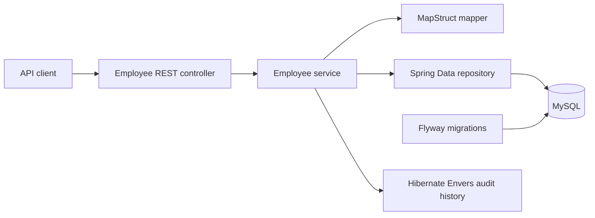

# Employee Service

A Spring Boot REST service for managing and searching employee records. The
repository demonstrates a production-oriented Java 21 service, MySQL schema
management, API documentation, container packaging, and automated verification.

The project originated as a small interview exercise and has since been
modernized while retaining its original `/api/employee` contract.

## Architecture



## Technology

- Java 21
- Spring Boot 4.1.1
- Spring Data JPA and Hibernate Envers
- MySQL 8.4 with Flyway migrations
- MapStruct 1.6.3
- springdoc OpenAPI 3.1
- Maven Wrapper 3.9.11
- Docker and GitHub Actions

## Run locally

Requirements: Java 21 and an accessible MySQL database.

```bash
export DB_URL='jdbc:mysql://localhost:3306/employee_service?serverTimezone=UTC'
export DB_USERNAME='employee_app'
export DB_PASSWORD='replace-me'
./mvnw spring-boot:run
```

The service listens on port `8085` by default. Override it with `SERVER_PORT`.
Flyway creates the schema on an empty database and Hibernate validates it.

## API

- `GET /api/employee`
- `GET /api/employee/{id}`
- `POST /api/employee`
- `PUT /api/employee/{id}`
- `DELETE /api/employee/{id}`
- `POST /api/employee/paging`

OpenAPI JSON is available at `/v3/api-docs`, and Swagger UI is available at
`/swagger-ui/index.html`.

Example create request:

```json
{
  "name": "Ada Lovelace",
  "role": "EMPLOYEE"
}
```

## Verify

```bash
./mvnw -B -ntp clean verify
```

The default suite uses an isolated in-memory H2 database. GitHub Actions also
starts MySQL 8.4 to verify the Flyway migration and Hibernate schema validation,
and builds the container image.

## Container

```bash
docker build -t employee-service .
docker run --rm -p 8085:8085 \
  -e DB_URL='jdbc:mysql://host.docker.internal:3306/employee_service?serverTimezone=UTC' \
  -e DB_USERNAME='employee_app' \
  -e DB_PASSWORD='replace-me' \
  employee-service
```

The runtime image uses Java 21, runs as a non-root user, and exposes an actuator
health check.

## Modernization status

The staged migration evidence is recorded in `.modernization/`. Authentication,
authorization, deployment topology, and production observability remain explicit
follow-up decisions; this repository should not be presented as deployment-ready
without addressing them.
